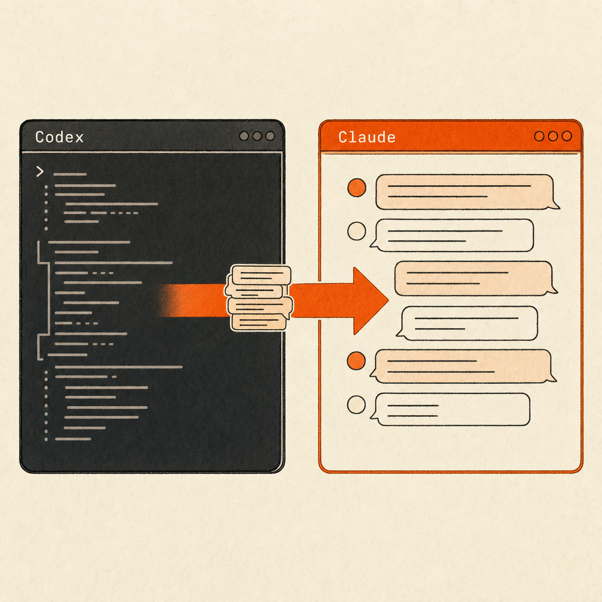

# codex2claude

Import a Codex session into Claude Code and resume it directly with `claude --resume` after quitting.
把一条 Codex 会话导入 Claude Code，退出后 `claude --resume` 直接接着聊。

Codex natively supports `import-from-Claude`, but the reverse direction has been missing. `codex2claude` fills that gap — shipped as a Claude Code plugin, one slash command does the job.
Codex 原生支持 `import-from-Claude`，反方向一直缺。`codex2claude` 补上这条——做成一个 Claude Code 插件，一个 slash 命令搞定。



## Install / 安装

Requires the [transession](https://github.com/inmzhang/transession) engine for transcoding:
需要引擎 [transession](https://github.com/inmzhang/transession) 做转码：

```sh
cargo install transession
```

Install the plugin (inside Claude Code):
装插件（Claude Code 内）：

```
/plugin marketplace add MisterBrookT/codex2claude
/plugin install codex2claude
```

## Usage / 用法

Inside Claude Code:
在 Claude Code 里：

```
/import-codex            # 默认：导入全部 Codex 会话（像 Codex 的反向）
/import-codex all        # 同上，显式
/import-codex <id>       # 只导指定 session id
```

Each session is written into its matching project directory by its own `cwd`, with deduplication. Quit after importing, then run `claude -r` in any project — the picker lists the just-imported Codex sessions; pick one to continue. No manual transcoding commands.
每条按它自己的 cwd 写进对应项目目录、去重。导完退出，在任意项目里跑 `claude -r`，picker 就列出刚导入的 Codex 会话，选一条接着聊。全程不手敲转码命令。

> Zero-token option: the slash command still passes through the model once per call. To burn zero tokens, run `bash ~/.claude/bin/import-codex.sh` directly in the terminal (or wrap it in an alias). Claude Code's custom slash commands must pass through one model round — this is a platform limit.
> 零 token 方案：slash 命令每次会过一次模型。想完全不耗 token，直接在终端跑 `bash ~/.claude/bin/import-codex.sh`（或包个 alias）。Claude Code 的自定义 slash 必经模型一轮，这是平台限制。

## How it works / 原理

```
~/.codex/sessions/*.jsonl  ──transession──▶  ~/.claude/projects/<cwd>/<id>.jsonl  ──▶  claude -r <id>
```

- **detect**: by default grabs the latest Codex rollout; can also take a session id
- **transcode**: reuses transession's universal IR to interconvert between the two formats
- **dedup**: `~/.claude/codex-import-ledger.tsv` tracks `codex_sid → claude_sid` so the same session isn't re-imported

- **detect**：默认抓最新一条 Codex rollout，也可传 session id
- **transcode**：复用 transession 的 universal IR 在两套格式间互转
- **dedup**：`~/.claude/codex-import-ledger.tsv` 记 `codex_sid → claude_sid`，同一条不重复导

## Limitations / 限制

Converts messages / tool calls / timestamps / metadata; **drops** the reasoning payload and runtime cache — enough context to resume, not a token-perfect replica.
转 messages / tool calls / timestamps / metadata，**丢** reasoning payload 和 runtime cache——resume 的上下文够用，不是逐 token 复刻。

## License / 许可证

MIT
